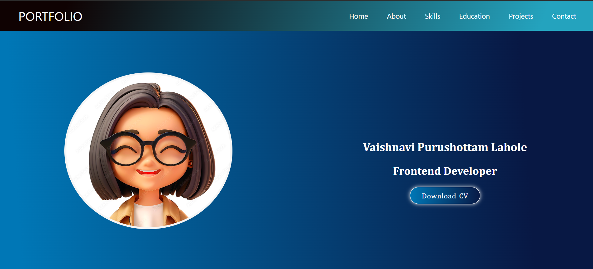

# My Portfolio Website



A modern and responsive portfolio website showcasing my skills, projects, and professional experience.

## Features

- Responsive design for all devices
- Interactive project showcase
- Skills section with detailed descriptions
- Education and experience timeline
- Contact information with social media links
- Downloadable resume

## Technologies Used

- HTML5
- CSS3
- JavaScript
- Responsive Web Design
- Font Awesome Icons

## Sections

1. **Home**
   - Profile picture
   - Name and tagline
   - Call-to-action button

2. **About Me**
   - Personal introduction
   - Skills and expertise
   - Professional summary

3. **Skills**
   - Technical skills
   - Soft skills
   - Skill level indicators

4. **Education**
   - Academic background
   

5. **Projects**
   - Project showcase with descriptions
   - Interactive project cards
   - Live demo and source code links

6. **Contact**
   - Email address
   - Social media links
   - Contact form

## Installation

1. Clone the repository:
   ```bash
   git clone https://github.com/yourusername/your-repo-name.git
   ```

2. Open the project folder:
   ```bash
   cd your-repo-name
   ```

3. Open `index.html` in your browser to view the portfolio.

